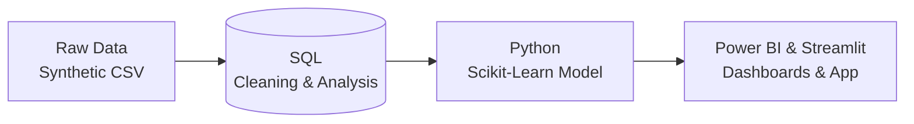

<div align="center">

# B2B SaaS Churn Analytics
### Predicting revenue at risk before it walks out the door

Churn isn't a sudden rage-quit. It's a slow, measurable fade. This project builds a pipeline that spots the fade, explains why it's happening, and flags accounts before they cancel.

[](https://saas-churn-prediction-system.streamlit.app/)


**[Dashboard](#dashboard)** · **[SQL Queries](data_prep/)** · **[ML Notebook](ml_deployment/MachineLearning.ipynb)** · **[Run It Locally](#deployment--app)**

</div>

---

## Contents

- [The Bottom Line](#bottom-line)
- [Business Insights from SQL EDA](#business-insights-from-sql-eda)
  - [Who Is Churning? (Firmographics)](#who-is-churning-firmographics)
  - [Why Are They Leaving? (Behavioral & Support Drivers)](#why-are-they-leaving-behavioral--support-drivers)
  - [The Pre-Churn Signature](#the-pre-churn-signature)
  - [Financial Impact](#financial-impact)
- [Strategic Recommendations](#strategic-recommendations)
- [SQL Feature Engineering & Master Table](#sql-feature-engineering--master-table)
- [Pipeline Architecture](#pipeline-architecture)
- [Screenshots](#dashboard)
- [Repository Structure](#repo-structure)
- [Limitations & Future Work](#limitations--future-work)
- [Deployment & App](#deployment--app)
- [Connect](#connect)

---

## The Bottom Line <a name="bottom-line"></a>

> By modeling the pre-churn signature, **241 active accounts** are flagged as high-risk today. Together they represent **$521,999 in Monthly Recurring Revenue**.

| Historical Snapshot (Power BI) | Value |
|---|---|
| MRR Churn Rate | 7.74% |
| Churned ARR (Total) | $641.88K |
| Logo Churn Rate | 14.57% |
| High-Risk Ticket Ratio | 34.75% |

| Predictive Model Output | Value |
|---|---|
| Active accounts flagged high-risk | 241 |
| MRR currently at risk | $521,999 |

*The dashboard shows what already happened. The model predicts what's coming.*

---

## Business Insights from SQL EDA <a name="business-insights-from-sql-eda"></a>

All 17 insights were derived directly from the SQL queries in `data_prep/eda.sql`. Each insight combines a **data observation** with a **business impact** statement, forming the foundation for the feature engineering that feeds the model.

### Who Is Churning? (Firmographics) <a name="who-is-churning-firmographics"></a>

| Insight | Key Finding | Business Impact |
|---------|-------------|-----------------|
| **1. Plan Tier as a Predictor** | Starter churns at 20.15%, Professional at 14.89%, Enterprise at just 4.00%. | Higher‑tier customers are far more loyal. Upselling is a retention lever, not just revenue growth. |
| **5. Annual Billing as a Retention Lever** | Annual billing halves churn for Starter accounts and reduces it 5x for Professional compared to monthly. | Push annual contracts—they are a proven retention strategy, not just a cash‑flow benefit. |
| **12. The “Paid” Channel Anomaly** | Paid Professional accounts churn at 26.5%—nearly double the Paid Starter rate (14.7%). | Paid ads targeting mid‑market tiers are acquiring poor‑fit customers. Ad copy and targeting need immediate review. |
| **13. The Cost of Scaling** | Peak acquisition (Q3–Q4 2023) directly correlated with peak churn (19%–21%). | Aggressive scaling sacrificed lead quality. Future volume metrics must be paired with retention guardrails. |
| **16. Country – Not a Usable Signal** | Country‑level sample sizes are too small (1‑6 companies) to yield statistical significance. | Exclude country from predictive models; rely on broader firmographics like industry or tier. |
| **17. Industry‑Specific Churn Risks** | Real Estate, Energy, Retail, Education, and Manufacturing churn >20% (4x low‑churn industries like Hospitality, Non‑Profit, Finance, Consulting). | Tailor onboarding and early intervention for high‑churn verticals; prioritize low‑churn industries for sales. |

### Why Are They Leaving? (Behavioral & Support Drivers) <a name="why-are-they-leaving-behavioral--support-drivers"></a>

| Insight | Key Finding | Business Impact |
|---------|-------------|-----------------|
| **2. Support Friction Correlates with Churn** | Churned companies filed an average of 4.5 high/critical tickets vs. 1.74 for retained. | High ticket severity is a strong warning sign. Treat repeated high/critical tickets as an escalation trigger. |
| **4. The Ticket‑Presence Trap** | Every single company (churned or retained) filed at least one ticket over 18 months. | Ticket presence alone is meaningless. Focus on severity and frequency. |
| **7. Team Adoption is Everything** | Retained companies average 13 active users and 1,400+ actions; churned average ~7 users and ~110 actions. | Getting more people on the team using the product is a retention driver, not just one champion. |
| **10. The Single Point of Failure** | In retained companies, the top user accounts for ~22% of activity; in churned, that jumps to 33%. | Churned accounts lean too heavily on one champion. If that person leaves, the account cancels. |
| **15. The “Silent NULL” Validation** | NULL satisfaction scores have nearly identical churn (22.2%) to rated tickets (23.2%). | Missing surveys indicate survey fatigue, not hidden churn. Exclude NULLs from the risk model safely. |

### The Pre‑Churn Signature <a name="the-pre-churn-signature"></a>

| Insight | Key Finding | Business Impact |
|---------|-------------|-----------------|
| **3. Satisfaction Score as an Early Indicator** | Churn drops sharply from 57.7% (score 1) to 6.2% (score 5). | Satisfaction is one of the strongest single predictors. Low scores should trigger proactive outreach. |
| **8. The “30‑Minute” Surprise** | When churned customers log in, they spend about the same time (30 min) as top customers. | The product works fine. The problem is login frequency, not the in‑app experience. |
| **9. The “Zombie” Accounts** | Retained companies stay active ~486 days; churned last ~260 days, but log only ~110 events total. | Churn is a slow fade, not a sudden decision. These accounts limp along for months before cancelling. |
| **11. The Pre‑Churn Decay** | 2‑6 months before churn, companies average 42 events/month; in the final 2 months, that drops to ~7 events (65% decline). | A sharp drop in monthly activity is an early warning sign. Step in before cancellation, not after. |

### Financial Impact <a name="financial-impact"></a>

| Insight | Key Finding | Business Impact |
|---------|-------------|-----------------|
| **6. The True Cost of Enterprise Churn** | Enterprise has fewest churned accounts (3) but highest loss per account: ~$35K contract value and ~$5.8K MRR. | Retention effort for Enterprise accounts deserves investment disproportionate to their headcount. |
| **14. Revenue‑at‑Risk (Predictive)** | 241 active companies show historical churn signals (CSAT 0‑2 or high/critical tickets), putting $521,999 MRR at risk. | Customer Success can use this logic to generate an automated hit‑list for proactive outreach. |

---

## Strategic Recommendations <a name="strategic-recommendations"></a>

1. **Automate the risk workflow.** Customer Success should reach out to the 241 flagged accounts using the “usage decay + low CSAT” trigger.
2. **Push annual billing.** Make annual the default option at checkout and in discounting for Starter and Professional plans.
3. **Audit the Paid channel.** Review targeting and ad copy for Professional‑tier paid campaigns—they’re pulling in accounts that churn fast.
4. **Rework onboarding KPIs.** Shift the focus from feature education to getting more seats active. Team‑wide adoption is the best protection against losing a champion.
5. **Protect Enterprise accounts.** Give them dedicated, VIP‑level Customer Success check‑ins. A low churn rate hides a high churn cost.

---

## SQL Feature Engineering & Master Table <a name="sql-feature-engineering--master-table"></a>

The EDA queries produced 17 insights, but the real analytical heavy lifting is in the final `customer_summary` table—a single, clean dataset that aggregates all predictive signals from the raw staging tables. This table is the direct input to the machine learning pipeline.

The query uses **five CTEs** to collapse multi‑row tables into one row per company:

- `support_summary` – ticket volume, severity, and average satisfaction.
- `base_usage` – total events, active users, and account lifespan.
- `champion_reliance` – the percentage of activity driven by the most active single user.
- `windowed_events` – activity counts in the final 60 days vs. 61‑180 days before churn/last event.
- A final `LEFT JOIN` onto subscriptions and company profiles ensures all companies are represented, with `COALESCE(...,0)` applied only to count columns. Ratio columns (`avg_satisfaction_score`, `lifespan_days`, `champion_reliance_percentage`) are left as `NULL` when no data exists—zero‑filling these would have incorrectly implied “worst possible score” instead of “missing.”

```sql
CREATE TABLE customer_summary AS
WITH support_summary AS (SELECT company_id,
                                COUNT(ticket_id)                                                  AS total_tickets,
                                SUM(CASE WHEN priority IN ('high', 'critical') THEN 1 ELSE 0 END) AS serious_tickets,
                                AVG(satisfaction_score)                                           AS avg_satisfaction_score
                         FROM staging_support_tickets
                         GROUP BY company_id),
     base_usage AS (SELECT company_id,
                           COUNT(event_id)                            AS total_events,
                           COUNT(DISTINCT (user_id))                  AS total_active_users,
                           DATEDIFF(MAX(event_date), MIN(event_date)) AS lifespan_days
                    FROM staging_usage_events
                    GROUP BY company_id),
     user_level_counts AS (SELECT company_id,
                                  user_id,
                                  COUNT(event_id) AS user_events
                           FROM staging_usage_events
                           GROUP BY company_id, user_id),
     champion_reliance AS (SELECT company_id,
                                  MAX(user_events) / SUM(user_events) * 100 AS champion_reliance_percentage
                           FROM user_level_counts
                           GROUP BY company_id),
     reference_dates AS (SELECT u.company_id,
                                u.event_date,
                                DATEDIFF(COALESCE(s.end_date, (SELECT MAX(event_date) FROM staging_usage_events)),
                                         u.event_date) AS days_ago
                         FROM staging_usage_events u
                                  JOIN staging_subscriptions s
                                       ON u.company_id = s.company_id),
     windowed_events AS (SELECT company_id,
                                SUM(CASE WHEN days_ago <= 60 THEN 1 ELSE 0 END)              AS late_window_events,
                                SUM(CASE WHEN days_ago BETWEEN 61 AND 180 THEN 1 ELSE 0 END) AS early_window_events
                         FROM reference_dates
                         GROUP BY company_id)
SELECT s.company_id,
       s.churn_flag,
       s.plan_tier,
       s.billing_cycle,
       c.industry,
       c.acquisition_channel,
       s.mrr,

       COALESCE(ss.total_tickets, 0)       AS total_tickets,
       COALESCE(ss.serious_tickets, 0)     AS serious_tickets,
       ss.avg_satisfaction_score,

       COALESCE(bu.total_events, 0)        AS total_events,
       COALESCE(bu.total_active_users, 0)  AS total_active_users,
       bu.lifespan_days,

       cr.champion_reliance_percentage,
       COALESCE(we.late_window_events, 0)  AS late_window_events,
       COALESCE(we.early_window_events, 0) AS early_window_events

FROM staging_subscriptions s
         JOIN staging_company_profiles c
              ON s.company_id = c.company_id
         LEFT JOIN support_summary ss
                   ON s.company_id = ss.company_id
         LEFT JOIN base_usage bu
                   ON s.company_id = bu.company_id
         LEFT JOIN champion_reliance cr
                   ON s.company_id = cr.company_id
         LEFT JOIN windowed_events we
                   ON s.company_id = we.company_id;
```

This master table is then fed into the Python modeling pipeline, where it is scaled, encoded, and used to train a Random Forest classifier with SHAP explanations.

---

## Pipeline Architecture <a name="pipeline-architecture"></a>



---

## Screenshots <a name="dashboard"></a>

**Executive Power BI Dashboard**


**Live Streamlit Prediction App**


**SHAP Summary Plot**


---

## Repository Structure <a name="repo-structure"></a>

```
b2b-churn-analysis-with-ml/
│
├── README.md
├── requirements.txt
├── .gitignore
│
├── /data                      # Raw synthetic source files
│     ├── company_profiles.xlsx
│     ├── subscriptions.xlsx
│     ├── support_tickets.xlsx
│     ├── usage_events.xlsx
│     └── customer_attrition_db_customer_summary.xlsx
│
├── /data_prep                 # SQL: schema setup, cleaning, EDA
│     ├── setup.sql
│     ├── cleaned_company_profiles.sql
│     ├── cleaned_subscriptions.sql
│     ├── cleaned_support_tickets.sql
│     ├── cleaned_usage_events.sql
│     └── eda.sql
│
├── /ml_deployment              # Model training + Streamlit app
│     ├── app.py
│     ├── MachineLearning.ipynb
│     ├── churn_rf_model.pkl
│     ├── model_columns.pkl
│     └── /.streamlit
│
└── /dashboard                  # Power BI file + screenshot
      ├── B2B SaaS Churn Dashboard.pbix
      └── B2B SaaS Churn Dashboard Screenshot.png
```

---

## Limitations & Future Work <a name="limitations--future-work"></a>

- The dataset is synthetic (~350 companies). Patterns are built to be realistic, but the sample size means model metrics should be read as a general direction, not a production‑grade guarantee.
- Future versions could test the annual‑billing incentive as a controlled experiment instead of just a correlation.
- Real‑time data refresh, instead of a static snapshot, would be a natural next step for a production version.

---

## Deployment & App <a name="deployment--app"></a>

### Live App
Try the pre-trained model directly (no setup required): **[saas-churn-prediction-system.streamlit.app](https://saas-churn-prediction-system.streamlit.app/)**
*(Deployed via Streamlit Community Cloud. Pushes to the main branch redeploy automatically).*

### Run Locally
The pre-trained model artifacts (`churn_rf_model.pkl`, `model_columns.pkl`) are included in the repository, so no database setup or model retraining is required to run the app.

**Prerequisites:** Python 3.9+ and pip.

1. **Clone & Setup:**
```bash
git clone [https://github.com/aryannair767/b2b-churn-analysis-with-ml.git](https://github.com/aryannair767/b2b-churn-analysis-with-ml.git)
cd b2b-churn-analysis-with-ml
python -m venv venv
source venv/bin/activate  # On Windows: venv\Scripts\activate
pip install -r requirements.txt
```

2. **Launch App:**
```bash
streamlit run ml_deployment/app.py
```
*The app will open automatically in your browser at `http://localhost:8501`.*

---

## Connect <a name="connect"></a>

<div align="center">

Built by **Aryan Nair**

[](https://www.linkedin.com/in/aryannair767/)
[](https://aryannair767.github.io/)

</div>
